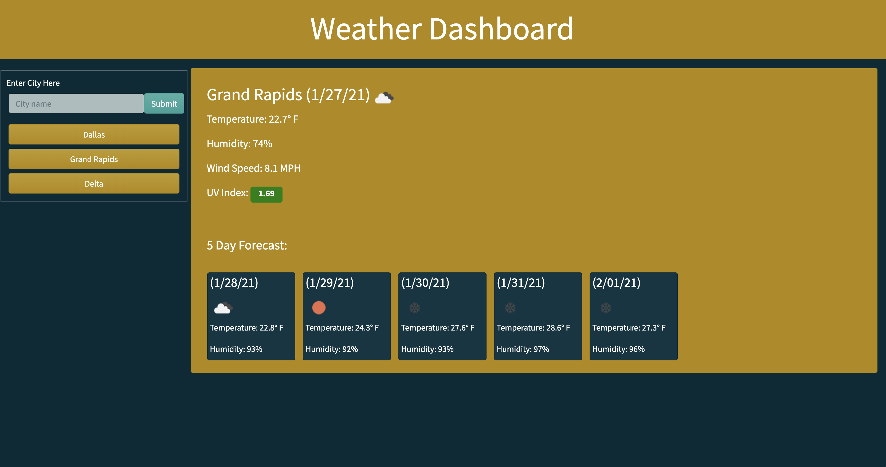

# City Search: A Weather Dashboard
An easy to use platform for comprehensive weather information per city.

## Deployed Site

Visit the live page [here](https://ahfotis.github.io/WeatherDashboard/).

## Reference Image

The following image showcases the app's form and function.


## App Overview
This app serves as a tool to compare weather conditions in multiple cities at once. The basic funcionality is as follows:
* Users input a city in the search input field.
* When the user presses a the submit button, the body of the page fills with the following information:
    * City name
    * City's local date
    * Visual Icon reflecting weather conditions
    * City's local temperature
    * City's local humidity
    * City's local wind speed
    * City's local UV Index
    * A five day forecase featuring date, weather icon, temperatrue, and humidity
* The searched for city is then added to the recent search list below the input field.
* When a user clicks on a previously saved city, that city's wehater info repopulates in the body of the page.
* When the page is refreshed, local storage is used to display the info for the last searched for city on the page.

## Project Criteria
### User Story

```
AS A traveler
I WANT to see the weather outlook for multiple cities
SO THAT I can plan a trip accordingly
```

### Acceptance Criteria

```
GIVEN a weather dashboard with form inputs
WHEN I search for a city
THEN I am presented with current and future conditions for that city and that city is added to the search history
WHEN I view current weather conditions for that city
THEN I am presented with the city name, the date, an icon representation of weather conditions, the temperature, the humidity, the wind speed, and the UV index
WHEN I view the UV index
THEN I am presented with a color that indicates whether the conditions are favorable, moderate, or severe
WHEN I view future weather conditions for that city
THEN I am presented with a 5-day forecast that displays the date, an icon representation of weather conditions, the temperature, and the humidity
WHEN I click on a city in the search history
THEN I am again presented with current and future conditions for that city
WHEN I open the weather dashboard
THEN I am presented with the last searched city forecast
```

## Credits
Weather info reutrned from OpenWeatherMap API.
Bootstrap and Bootswatch utilized for design.
Criteria provided by Trilogy Education Services, LLC, a 2U, Inc. brand. Confidential and Proprietary. All Rights Reserved.

## License
MIT License

Copyright (c) [2021] [Anna Hickey Fotis]